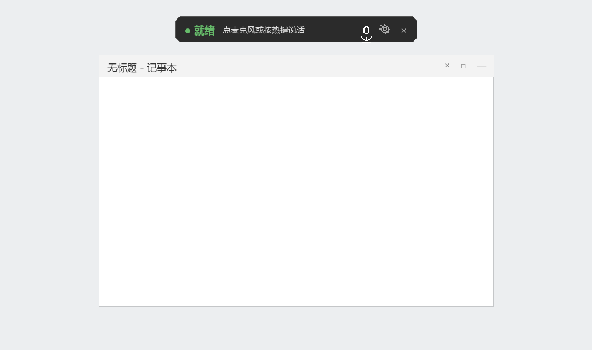
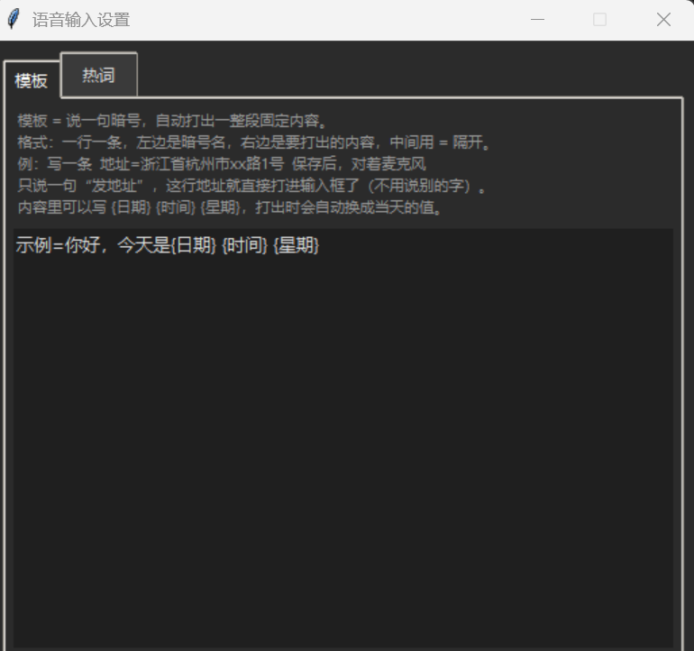
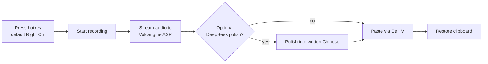
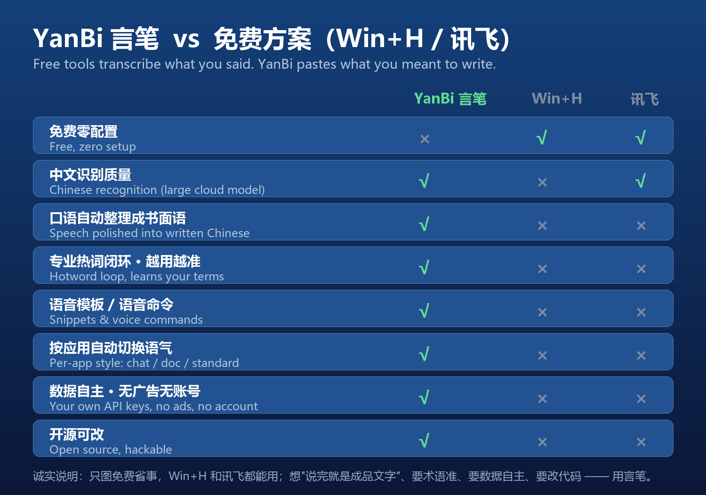

[English](README.md) | [简体中文](README.zh-CN.md)

# YanBi 言笔 · Voice Typing for Windows

[](LICENSE)
[](https://github.com/sannongwangluo/yanbi/releases/latest)
[](https://github.com/sannongwangluo/yanbi/releases)
[](#)
[](https://github.com/sannongwangluo/yanbi/actions/workflows/ci.yml)

A Windows desktop voice-typing tool that replaces the built-in Win+H. Press a hotkey to start recording, press it again to stop, and the transcript is pasted wherever your cursor was. Recognition runs on Volcengine's Doubao streaming speech recognition (cloud WebSocket); the transcript can optionally be polished into written Chinese by DeepSeek, and a hotword loop corrects recurring misrecognitions.

> YanBi is a Chinese input tool — voice commands and trigger phrases are spoken in Chinese.

> ⬇️ **Download:** [YanBi.exe (latest release)](https://github.com/sannongwangluo/yanbi/releases/latest)



## Features

- Cloud streaming ASR: audio is streamed as you speak and the full text appears the moment you stop; if streaming fails it falls back to full-utterance recognition, so a result is never lost
- Optional DeepSeek polishing: automatically picks `chat` / `doc` / `standard` style based on the focused app
- Hotword loop: an external `hotwords.txt` is passed straight to the ASR (`corpus.context`); say "记一下 / 忘掉" to add or remove words, or run `--learn-words` to mine frequent corrections from the log
- Voice snippets `snippets.txt`: say "发X" to paste a fixed block, with `{日期}` `{时间}` `{星期}` placeholders
- Voice triggers: "正式点", "口语一点", "翻译成英文" switch the polish style on the fly
- Borderless always-on-top float bar: live status, mic button for manual control, gear button opens settings
- Chime sounds `chime_start.wav` / `chime_end.wav` mark recording start and end

## Screenshots


The floating bar in its ready state: status indicator, hint text, and the mic / gear / close buttons.



The settings window: snippets and hotwords tabs.

## How it works

Press the hotkey to start recording (audio streams to Volcengine as you speak, with a local copy kept as fallback), press again to stop, and the cloud returns the full transcript. Optionally it goes through DeepSeek for polishing, then focus returns to the target input and the text is pasted via a simulated Ctrl+V, restoring the original clipboard. Every step degrades gracefully, so a recognition result is never lost.



## How it compares to offline solutions (e.g. CapsWriter-Offline)

YanBi uses a cloud API — there is no local model. Both the benefits and the costs come from that:

- Pros: no large model to download or load, strong recognition (server-side language-model decoding returns empty results for silence/noise instead of hallucinating text), built-in written-Chinese polishing and hotword loop
- Cons: pay-per-use, requires internet, audio is uploaded to the cloud

If you'd rather keep audio off the cloud, or want a fully offline, pay-once experience, a local offline tool like CapsWriter-Offline is a better fit.

## vs free options (Win+H built-in, iFlytek/讯飞)

Windows has Win+H voice typing built in, and iFlytek is free — why YanBi? **Free tools transcribe what you said; YanBi pastes what you meant to write.**



- **Speech → written Chinese**: spoken rambling goes in, polished written text comes out (DeepSeek), with per-app style (chat / doc / standard) — free tools paste raw transcripts
- **Hotword loop**: your jargon goes straight to the ASR and is protected during polishing, so it gets more accurate the more you use it
- **Snippets & voice commands**: say "发X" to paste a saved block; "记一下" to teach a word
- **Your own API keys**: no account, no ads, no consumer-cloud ecosystem
- Trade-off, honestly: YanBi is pay-per-use and needs ~10 minutes of API setup; if you just want free and instant, Win+H or iFlytek will do

## Installation

Requires Python 3.12+ (`numpy>=2.5.2` in `requirements.txt` needs 3.12, `websockets>=17` needs 3.11; the code itself runs on lower versions, but 3.12+ is documented to match the dependency floors).

```bash
pip install -r requirements.txt
```

## Configuration

Both API keys are set through environment variables:

| Variable | Required | Notes |
| --- | --- | --- |
| `VOLC_API_KEY` | Yes | Volcengine "Speech technology" console: create an app → enable "Large-model streaming speech recognition" → get the API key. Console: <https://console.volcengine.com> |
| `DEEPSEEK_API_KEY` | Optional | When unset, polishing is skipped and the raw transcript is pasted. Console: <https://platform.deepseek.com> |

> Billing is pay-per-use; see the consoles above for current pricing.

The polish toggle has three equivalent entry points: the `--no-polish` flag, the `VOICE_POLISH=0` environment variable, or simply not setting `DEEPSEEK_API_KEY` (with no key, `polish_text` returns the original text).

## Usage

```bash
python voice_input.py
```

- The default hotkey is **Right Ctrl**: press once to start recording (chime), press again to stop; after transcription/polishing the text is pasted into the input you were just using. Change it with `--keys` (a comma-separated list).
- The float bar shows idle / recording / transcribing / polishing / error status. Click the mic to start/stop manually, the gear to open settings (snippets + hotwords tabs), the × to quit.
- Voice triggers (take priority over the focused-app style): start with "正式点" or "口语一点" to change the polish style, or "翻译成英文" to translate the transcript to English.
- Voice commands: say "记一下，张伟" to add "张伟" to the hotwords, "忘掉，张伟" to remove it.
- Voice snippets: say "发示例" to paste the content mapped to `示例` in `snippets.txt`.

All voice commands, triggers, and snippet keys are spoken in Chinese.

## Hotwords and snippets

Both files live next to the tool, are UTF-8 encoded, are auto-created with defaults on first run, and are re-read at the start of every recording (no restart needed after editing).

- `hotwords.txt`: one word per line; empty lines and `#` comments are ignored. Words are passed to the ASR as recognition hints (`corpus.context`) and act as a whitelist that polishing won't rewrite.
- `snippets.txt`: one `name=content` entry per line; empty lines and `#` comments are ignored. Content may contain `{日期}` `{时间}` `{星期}`, replaced with today's values on paste.

## Privacy

- Audio is uploaded to Volcengine in real time for recognition; the transcript is sent to the DeepSeek API when polishing.
- Nothing else is collected or uploaded (no telemetry, no analytics).
- The runtime log `voice_input.log`, hotwords `hotwords.txt`, and snippets `snippets.txt` stay local to the tool directory.

## File structure

```
voice_input.py        main program: tkinter float bar + recording + pasting
volc_asr.py           Volcengine streaming ASR protocol module (self-contained WebSocket codec)
requirements.txt      dependencies
chime_start.wav       recording-start chime
chime_end.wav         recording-end chime
hotwords.txt          hotword list (auto-created on first run, gitignored)
snippets.txt          voice snippets (auto-created on first run, gitignored)
voice_input.log       runtime log (gitignored)
```

## Command-line arguments

| Argument | Description |
| --- | --- |
| (none) | Start the GUI and listen for the hotkey |
| `--test SECONDS` | Self-test: record N seconds, transcribe and print, without pasting |
| `--test-stream SECONDS` | Mic-free self-test: read `test_tts.wav` from the same directory and stream it, print the text and last-packet latency |
| `--test-polish TEXT` | Mic-free self-test: run the trigger / voice-command / polish pipeline on TEXT and print the result |
| `--debug` | Diagnostics: print every key name for 30 seconds to debug hotkey conflicts |
| `--keys LIST` | Override the default hotkey, comma-separated (default `right ctrl`) |
| `--no-polish` | Disable DeepSeek polishing |
| `--learn-words` | Mine frequent corrections from `voice_input.log`; ≥3 occurrences are auto-added, the rest are nominated by the LLM |

## FAQ

- **The hotkey does nothing**: the `keyboard` library's global hotkey hook on Windows usually needs admin rights. Right-click → "Run as administrator", or use `--debug` to print key names and confirm the hook receives them.
- **`--test-stream` says file not found**: `test_tts.wav` is not included in the repo — supply your own 16 kHz test wav in the tool directory.

## Roadmap

- Automated CI packaging (added in this change)
- Customizable voice triggers
- More translation target languages

## License

[MIT](LICENSE) © 2026 Hangzhou Sannong Network Technology Co., Ltd.
