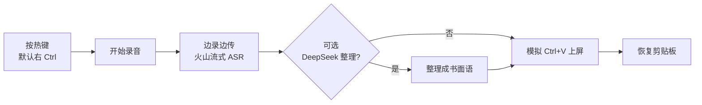

[English](README.md) | [简体中文](README.zh-CN.md)

# YanBi 言笔 · Voice Typing for Windows

Windows 桌面语音输入工具，用来替代系统自带的 Win+H：按下热键开始录音、再按一次结束，转写结果自动粘贴到当前输入焦点处。识别走火山引擎豆包大模型流式语音识别（云端 WebSocket），转写后可选用 DeepSeek 整理成书面语，并带一套热词纠错闭环。

## 特性

- 火山云端流式 ASR：边录边传，松手即出全文；流式失败自动回退整段识别，绝不丢结果
- DeepSeek 书面语整理（可关）：按焦点窗口自动切换 `chat` / `doc` / `standard` 三种整理风格
- 热词闭环：`hotwords.txt` 外置词表直传 ASR（`corpus.context`），支持语音命令「记一下 / 忘掉」，`--learn-words` 从日志挖高频纠正词
- 语音模板 `snippets.txt`：说「发X」直接上屏一段固定内容，支持 `{日期}` `{时间}` `{星期}`
- 语音触发词：「正式点」「口语一点」「翻译成英文」实时切换整理风格
- 置顶无边框浮窗：实时显示状态，麦克风按钮手动触发，齿轮按钮打开设置窗
- 提示音 `chime_start.wav` / `chime_end.wav`，录音开始/结束有水滴提示音

## 截图


浮窗就绪状态实拍：状态指示 + 提示文字 + 麦克风 / 齿轮 / 关闭三个按钮。


设置窗实拍：模板 / 热词两页，可直接编辑保存。

## 工作原理

按一下热键开始录音（音频边录边上传火山云端做流式识别，同时本地留底兜底），再按一下结束，云端返回全文；可选走 DeepSeek 整理成书面语，最后把焦点切回目标输入框、模拟 Ctrl+V 粘贴上屏，并恢复原剪贴板内容。任何一步失败都有降级路径，不会丢识别结果。



## 与离线方案（如 CapsWriter-Offline）的区别

本工具走云端 API，不做本地模型。代价和收益都源于此：

- 优点：免下载/加载大模型、识别能力强（服务端做语言模型解码，静音/噪声返回空结果、不会幻觉出文本）、自带书面语整理和热词闭环
- 缺点：按量付费、需要联网、音频会上传云端

如果你介意音频上云，或想要完全离线、一次性买断的体验，选 CapsWriter-Offline 这类本地离线方案更合适。

## 安装

依赖 Python 3.12+（`requirements.txt` 中 `numpy>=2.5.2` 要求 3.12、`websockets>=17` 要求 3.11；代码语法本身更低，但按依赖下限标注 3.12+）。

```bash
pip install -r requirements.txt
```

## 配置

两个 API key 都通过环境变量配置：

| 变量 | 是否必填 | 说明 |
| --- | --- | --- |
| `VOLC_API_KEY` | 必填 | 火山引擎「语音技术」控制台：创建应用 → 开通「大模型流式语音识别」→ 获取 API Key。官方控制台 <https://console.volcengine.com> |
| `DEEPSEEK_API_KEY` | 可选 | 不配置时跳过书面语整理、直接上屏识别原文。官方控制台 <https://platform.deepseek.com> |

> 计费按量、以官方页面为准，具体价格请见上述控制台。

整理开关有三个等价入口：命令行 `--no-polish`、环境变量 `VOICE_POLISH=0`、以及不配置 `DEEPSEEK_API_KEY`（无 key 时 `polish_text` 直接返回原文）。

## 使用方法

```bash
python voice_input.py
```

- 默认热键是 **右 Ctrl**：按一下开始录音（提示音），再按一下结束，稍候转写/整理完成后自动上屏到刚才的输入框。热键可用 `--keys` 改成逗号分隔的多个键。
- 浮窗显示待机 / 录音中 / 转写中 / 整理中 / 出错状态；点麦克风按钮手动开始/停止，点齿轮按钮打开设置窗（模板 + 热词两页），点关闭按钮退出程序。
- 语音触发词（优先于窗口风格判定）：说话开头带「正式点」「口语一点」改变整理风格，带「翻译成英文」把转写翻译成英文。
- 语音命令：说「记一下，张伟」把「张伟」加进热词表，「忘掉，张伟」删掉它。
- 语音模板：说「发示例」把 `snippets.txt` 里 `示例` 对应的内容上屏。

## 热词与模板自定义

两个文件都在工具目录下，UTF-8 编码，首次运行时自动生成内置默认示例，之后每次开始录音都会重新读取（改完不用重启）。

- `hotwords.txt`：一行一个词，忽略空行和以 `#` 开头的注释行。写入的词直传 ASR 作为识别提示（`corpus.context`），同时作为整理时的白名单不被改写。
- `snippets.txt`：一行一条 `名字=内容`，忽略空行和 `#` 注释。内容里可写 `{日期}` `{时间}` `{星期}`，上屏时替换成当天的值。

## 隐私说明

- 录音音频实时上传火山引擎云端做识别；整理时转写文本发给 DeepSeek API。
- 不采集、不上传其他任何数据（无遥测、无统计上报）。
- 运行日志 `voice_input.log`、热词表 `hotwords.txt`、模板 `snippets.txt` 都只存在本地工具目录。

## 文件结构

```
voice_input.py       主程序：tkinter 置顶浮窗 + 录音 + 上屏
volc_asr.py          火山流式 ASR 协议模块（自包含 WebSocket 编解码）
requirements.txt     依赖清单
chime_start.wav      录音开始提示音
chime_end.wav        录音结束提示音
hotwords.txt         热词表（首次运行自动生成，已 gitignore）
snippets.txt         语音模板（首次运行自动生成，已 gitignore）
voice_input.log      运行日志（运行中生成，已 gitignore）
```

## 命令行参数

| 参数 | 说明 |
| --- | --- |
| （无参数） | 启动 GUI，进入热键监听 |
| `--test 秒` | 自测：录 N 秒、转写并打印，不上屏 |
| `--test-stream 秒` | 无麦自测：读同目录 `test_tts.wav` 边录边传，打印文本与末包耗时 |
| `--test-polish 文本` | 无麦自测：跑触发词/语音命令/整理全链路并打印结果 |
| `--debug` | 诊断：30 秒内打印所有按键名，排查热键冲突 |
| `--keys 键列表` | 覆盖默认热键，逗号分隔（默认 `right ctrl`） |
| `--no-polish` | 禁用 DeepSeek 书面语整理 |
| `--learn-words` | 从 `voice_input.log` 挖掘高频纠正词，≥3 次自动入库，其余交 LLM 提名 |

## 常见问题

- **热键没反应**：`keyboard` 库在 Windows 上的全局热键钩子通常需要管理员权限。右键「以管理员身份运行」，或用 `--debug` 打印按键名确认钩子是否收到按键。
- **`--test-stream` 报找不到文件**：仓库未收录 `test_tts.wav`，需自备一个 16kHz 的测试 wav 放到工具目录。

## License

[MIT](LICENSE) © 2026 杭州三农网络科技有限公司
